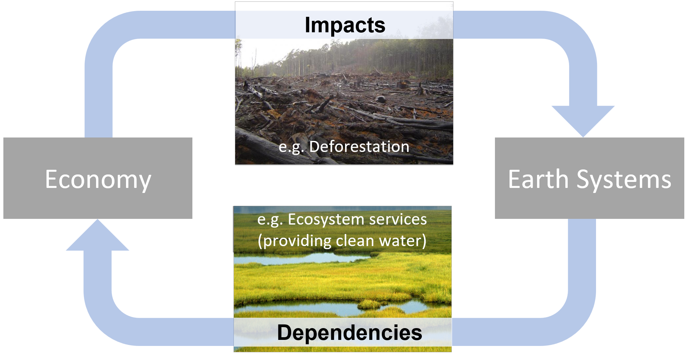
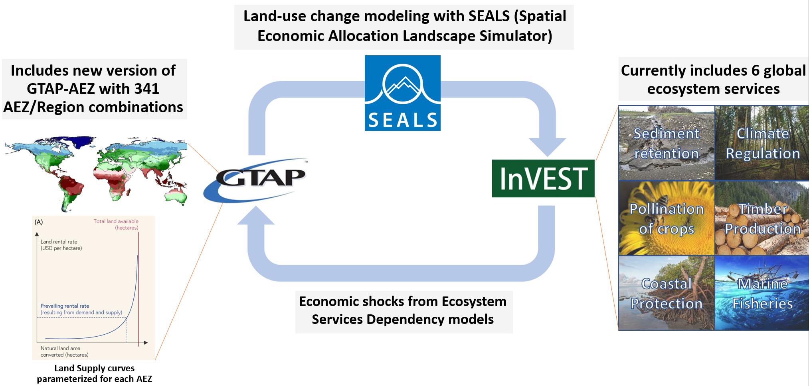

# Overview of GTAP-InVEST v0.9.0

GTAP-InVEST is a global earth economy model that integrates a computable general equilibrium (CGE) model, a land-use change (LUC) model, and a ecosystem services (ES) model. This repository contains the version (v0.9.0, dubbed "PNAS version") of GTAP-InVEST that corresponds to Johnson et al. (2023) in the Proceedings of the National Academy of Sciences. This readme file documents how to run version 0.9.0 or GTAP-InVEST from a technical point of view. For broader information, please also see the [Project Website](https://justinandrewjohnson.com/gtap_invest/), the [GTAP-InVEST User Guide](https://justinandrewjohnson.com/gtap_invest/user_guide/), or the download page of [results from the PNAS article](https://justinandrewjohnson.com/gtap_invest/results/). Additionally, we are hosting a live, visualization tool at <https://mygeohub.org/tools/gtapinvest>, which should be coming online shortly after official publication.



GTAP-InVEST originated from several academic papers, including:

-   "The Economic Case for Nature" (Johnson et al. 2021, World Bank Report, <https://www.worldbank.org/en/topic/environment/publication/the-economic-case-for-nature>)

-   "Projected landscape-scale repercussions of global action for climate and biodiversity protection" (von Jeetze et al. 2023, Nature Communications, <https://www.nature.com/articles/s41467-023-38043-1>)

-   "Closing yield gap is crucial to avoid potential surge in global carbon emissions" (Suh et al. 2020, Global Environmental Change, <https://doi.org/10.1016/j.gloenvcha.2020.102100>)

-   "Global Future: Assessing The Global Economic Impacts of Environmental Change to Support Policy-Making" (Roxburg et al. 2020, World Wildlife Fund, <https://www.gtap.agecon.purdue.edu/resources/res_display.asp?RecordID=5987>).

Prior versions of this repository include v0.8.0, which was the version used in the Economic Case for Nature under the Road to Kunming project, commissioned by the World Ban.

## Model components

The GTAP-InVEST model is written in Python, C, R, and GEMPACK. All of the code specific to GTAP-InVEST is open source, but it requires a proprietary license for GEMPACK to recompile the CGE executable and it requires access/purchase of version 10 of the GTAP database. The three building blocks of the model, documented in more detail below are:

1.  The GTAP-AEZ (Agroecological Zones) model, which calculates equilibrium prices, quantities, GDP, trade and many other economic variables, and most notably for this exercise, endogenously calculates how land is used in different sectors and how natural land is brought into economic use through agricultural, pasture and managed forest expansion.
2.  The Spatial Economic Allocation Landscape Simulator (SEALS) model, which downscales regional estimates of land-use change from GTAP-AEZ to a high enough resolution (300m) to run ecosystem service models.
3.  InVEST, which takes the downscaled land-use, land-cover maps from SEALS to calculate changes in ecosystem service provision. These ecosystem service changes are then further expressed as shocks to the economy and used as inputs into a second run of GTAP-AEZ, which calculates how losses of ecosystem services affect economic performance.



## Software Installation

GTAP-InVEST requires a considerable amount of technical skill to run and involves multiple different programming languages and paradigms. Future versions of GTAP-InVEST will aim to simplify this software complexity, but for now, because this is the first "hard-linked" version of a global ecosystem service and general equilibrium model, there still exist many suboptimal design choices that were necessary in "gluing together" all of these models. Python is used as the main glue of the model while each of the preexisting models are coded in their default language. This section describes how to get the combined model software running.

### Python Installation

GTAP-InVEST uses the open-source Hazelbean library to organize and manage the code. Hazelbean is a collection of geospatial processing tools based on gdal, numpy, scipy, cython, pygeoprocessing, taskgraph, natcap.invest, geopandas and many others to assist in common spatial analysis tasks in sustainability science, ecosystem service assessment, global integrated modelling assessment, natural capital accounting, and/or calculable general equilibrium modelling. The installation instructions here are a "kitchen-sink" approach to installing every relevant library, which means this could be greatly simplified in future versions.

-   Install Mambaforge from https://github.com/conda-forge/miniforge#mambaforge
-   For convenience, during installation, I select yes for "Add Mambaforge to my PATH environment Variable"
-   (PC) Open the Miniforge Prompt (search for it in the start menu) or (Mac) just type "mamba init"
-   Create a new mamba environment with the following commands (here it is named gtap_invest_env):

`mamba create -n gtap_invest_env -c conda-forge`

-   Activate the environment

`mamba activate gtap_invest_env`

-   Install libraries using conda command:

`mamba install -c conda-forge natcap.invest geopandas rasterstats netCDF4 cartopy xlrd markdown qtpy qtawesome plotly descartes pygeoprocessing taskgraph cython rioxarray dask google-cloud-datastore google-cloud-storage aenum anytree statsmodels openpyxl seaborn twine pyqt ipykernel imageio pandoc`

-   And then finally, install non-conda distributions via pip:

`pip install mglearn pandoc datascience hazelbean`

# Replicate results from GTAP-InVEST PNAS paper

After you have installed the scientific computing stack described above, the simplest way to run GTAP-InVEST is to clone the repository and then open run_replicate_gtap_invest_pnas.py in your preferred editor. At the top of this file, you will define the project name and the project directory where all files will be saved. Once these are set, you should be able to run run_test_gtap_invest_pnas.py in your preferred way, ensuring that you are in the Conda environment discussed above. This could be achieved in VS Code by selecting the Conda environment in the bottom-right status bar and then selecting run. Alternatively, this could be done via the command line with the command `mamba activate gtap_invest_env` and then `python run_replicate_gtap_invest_pnas.py` in the appropriate directory.

### Project Flow

One key component of Hazelbean is that it manages directories, base_data, etc. using a concept called ProjectFlow. ProjectFlow defines a tree of tasks that can easily be run in parallel where needed and keeping track of task-dependencies. ProjectFlow borrows heavily in concept (though not in code) from the task_graph library produced by Rich Sharp but adds a predefined file structure suited to research and exploration tasks. Project flow works by initializing a ProjectFlow object in run.py, which then calls all subsequent tasks and functions defined in other python files. The run.py file is the only place where user supplied (possibly absolute but can be relative) path is stated. The ProjectFlow object, denoted p by convention, is the one global variable used throughout all parts of hazelbean and GTAP-InVEST. Here, we give code examples of using ProjectFlow.

``` python
import hazelbean as hb

if __name__ == '__main__':
    p = hb.ProjectFlow(r'C:\Files\Research\cge\gtap_invest\projects\feedback_policies_and_tipping_points')
```

In a multi-file setup, in the run.py you will need to import different scripts, such as main.py i.e.:

``` python
import visualizations.main
```

The script file main.py can have whatever code, but in particular can include "task" functions. A task function, shown below, takes only p as an agrument and returns p (potentially modified). It also must have a conditional (if p.run_this:) to specify what always runs (and is assumed to run trivially fast, i.e., to specify file paths) just by nature of having it in the task tree and what is run only conditionally (based on the task.run attribute, or optionally based on satisfying a completed function.)

``` python
def example_task_function(p):
    """Fast function that creates several tiny geotiffs of gaussian-like kernels for later use in ffn_convolve."""

    if p.run_this:
        for i in computationally_intensive_loop:
            print(i)
```

Functions that are to be used as tasks are added to the ProjectFlow object as follows:

``` python
def add_all_tasks_to_task_tree(p):
    p.example_task = p.add_task(example_task_function)
```

At the bottom of the run.py file, p.execute() is called, which runs all tasks in order and contingent on whether they are set to run (via p.example_task.run = True) and/or whether they will skip tasks that already have outputs (via p.example_task.skip_existing).

The documentation for each task is included in the task's call signature, which you can read for more details. Here, we describe some of the more challenging tasks in detail.

# GTAP-AEZ

The version of the GTAP-AEZ model in this repository is based on the project with University of Minnesota and World Bank i.e. "The Economic Case for Nature". Land use change in GTAP is fed to the InVEST model to generate changes in ecosystem services (mainly pollination, forestry carbon and marine fisheries). These changes are fed back to the GTAP-AEZ model as productivity shocks to the crop sector, forestry sector and marine fisheries sector.

There are two methods by which the GTAP-AEZ model can be run.

Running the GTAP-AEZ model, method 1 (direct): The GTAP-AEZ model is documented in the tab file (gtapaez.tab) which is a text file and can be opened in any text editor. This tab file is compiled as an executable file under Windows OS (GTAPAEZ.exe) using a fortran compiler. To run all the scenarios just click "zzz_run_all.bat" in the main folder. This file is a batch file that runs all the command files for all scenarios sequentially (see \*.cmf file in the cmfs folder).

Inputs: Inputs to the simulations are summarized in the command file (\*.cmf file). The cmf file tells where to find the model inputs and when to store the model outputs. Most of the inputs are in the main directory either as text file or har file.

Outputs: Once the experiments are finished solving these are stored under the "work" folder. The main output file is the solution file \*.sl4 which can be viewed by the GEMPACK software suite (https://www.copsmodels.com/gempack.htm)

Post processing: To process the model output files into csv format, postprocessing is needed (see postsims folder). The R code 01_output_csv.r is the main workflow that converts the \*.sl4 file to csv file format. User needs to copy all the outputs in the "work" folder to the "postsims\in\gtap" folder. Also, additional GEMPACK files to be installed (namely sltoht.exe and har2csv.exe). The latest version can be downloaded in https://www.copsmodels.com/ftp/gpextra/bundle20.exe or visit the website https://www.copsmodels.com/gpmark9.htm. After the post processing is done, the final outputs can be located in "postsims\out" folder

Misc notes: Batch file that runs all the scenarios, calls a command file, which summarizes all the inputs GTAP needs. Says where inputs, shocks, variables, closure. Call GTAP using TAB File, need an executable, generated with a fortran compiler.

Running the GTAP-AEZ model, method 2 (project flow):

Instead of running the bat file, you can also just run run GTAP-AEZ via the corresponding tasks in projectflow (eg p.gtap1_aez_task)

## Errata

The above commands are valid for Windows users. For Mac users, replace `-v %cd%` with `` -v `pwd` ``

## Numpy errors

If numpy throws "wrong size or changes size binary": upgrade numpy at the end of the installation process. See for details: https://stackoverflow.com/questions/66060487/valueerror-numpy-ndarray-size-changed-may-indicate-binary-incompatibility-exp

## Mac specific errors

Your python environment has to have permissions to access and write to the base data folder.

# More information

See the author's personal webpage, https://justinandrewjohnson.com/gtap_invest for more details about the underlying research.